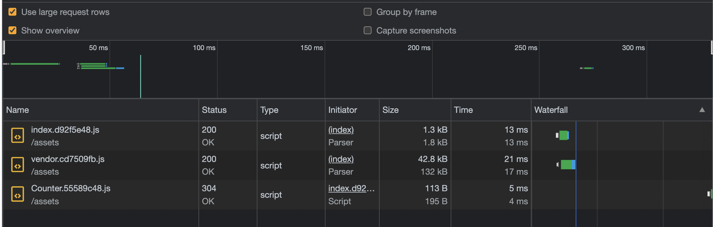

# Abell Partial Hydration with React

Demo: https://stackblitz.com/github/saurabhdaware/abell-partial-hydration-react-experiment

Read more about partial hydration here - https://docs.astro.build/en/core-concepts/component-hydration/

In this example, we're hydrating the `Navbar` component as soon as possible.

We don't hydrate `About` component at all since it's purely static. We use `ReactDOMServer.renderToStaticMarkup` to render the `About` component to a static HTML string.

We lazy-load and hydrate the `Counter` component after 5 seconds.

## Running the example

- git clone the repo
- Install dependencies
```sh
npm install
```
- Run the example
```sh
npm run dev
```

## Request Flow

You can see the `Navbar` was bundled along-side the other code in `index.js` and it was loaded as soon as possible. Thus the Navbar was interactive even before the rest of the page (in this case, `Counter`) was loaded.



---

Built with [Abell](https://github.com/abelljs/abell)